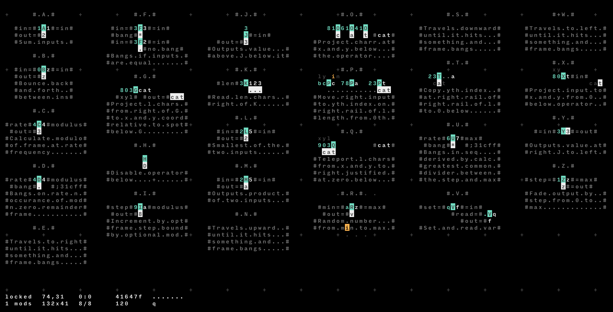

# Futzing around with Orca by @hundredrabbits

This is just a personal repo of items related to early practice and study of https://github.com/hundredrabbits/Orca. I'm lowkey obsessed with the tool and here we are.